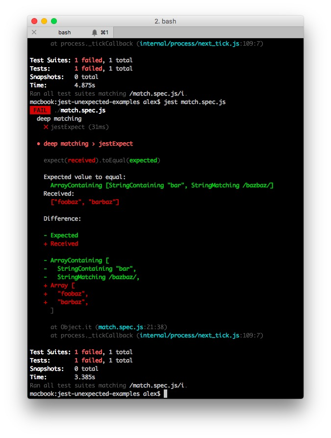
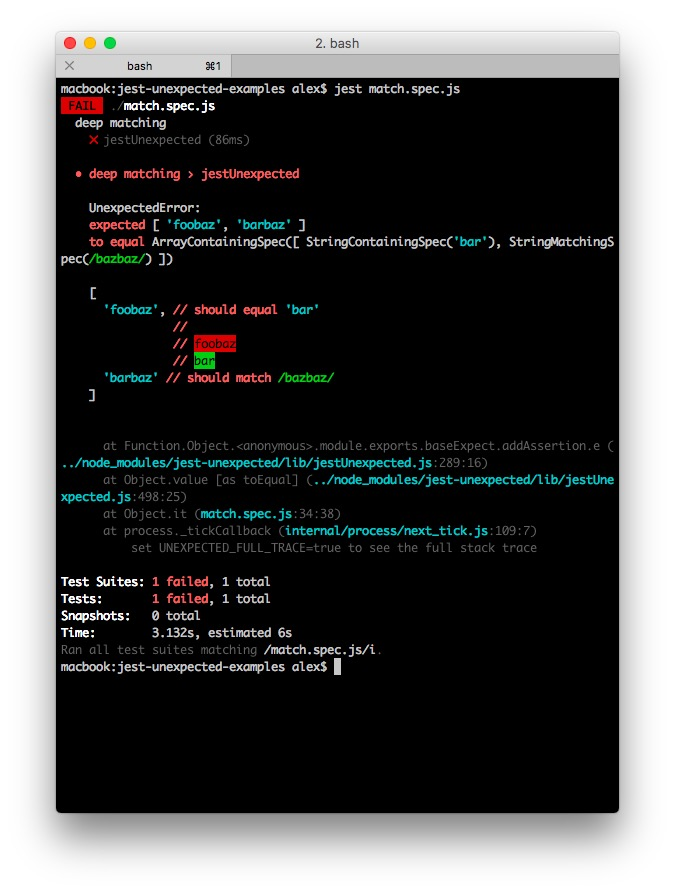

# Jest-Unexpected

[](https://travis-ci.org/alexjeffburke/jest-unexpected)

This library provides a mapping layer allowing assertions using Jest `expect`
API to execute via Unexpected and leverage it's output capabilities.

Jest-Unexpected aims to be a drop-in such that using it within an existing test
suite is as simple as `npm install jest-unexpected` and adding a require:

```js
const expect = require('jest-unexpected');

describe('a null value', () => {
    it('should equal null', () => {
        expect(null).toEqual(null);
    });
});
```

Read [the documentation](https://alexjeffburke.github.io/jest-unexpected/).

## Compatibility

Almost the entirety of Jest `expect` API in implemented with only the following
missing methods which the library will highlight during execution (an exception
will be thrown with a clear message indicating the method name):

* snapshot related functionality
    - toMatchSnapshot()
    - toThrowErrorMatchingSnapshot()
    - expect.addSnapshotSerializer()
* extension related functionality
    - expect.extend()
* secondary assertion aliases

This library supports and is tested against node version **6** and above.

## Output

Unexpected has very powerful output capabilities with features such as inline
diff rendering for complex objects and an emphasis on being able to rapidly
locate issues and provide hints as to corrections.

The examples included here showcase some of these differences via comparisons.

### Array containing string and regex members




